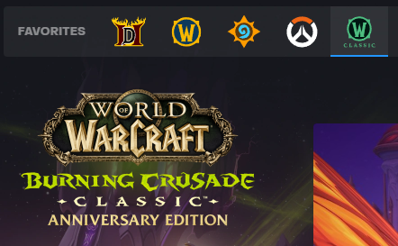
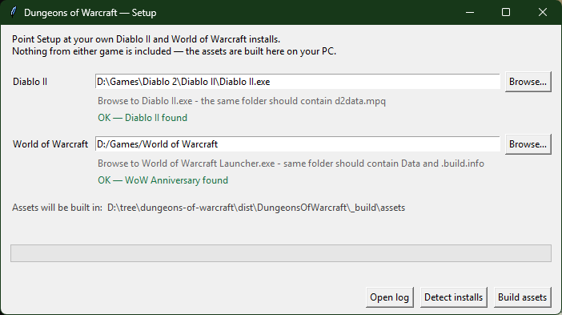
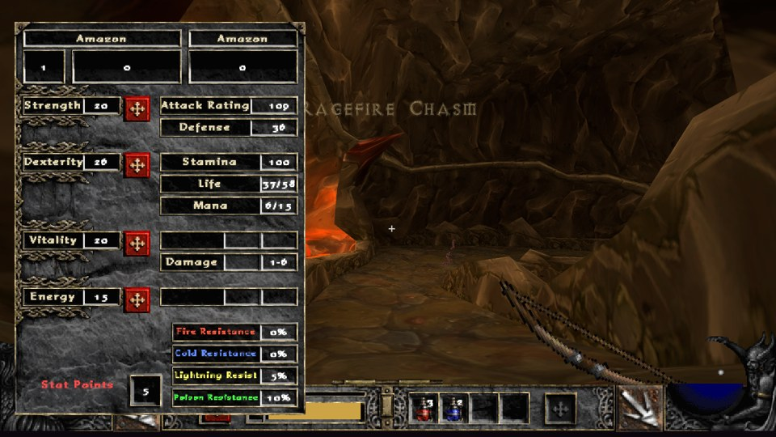
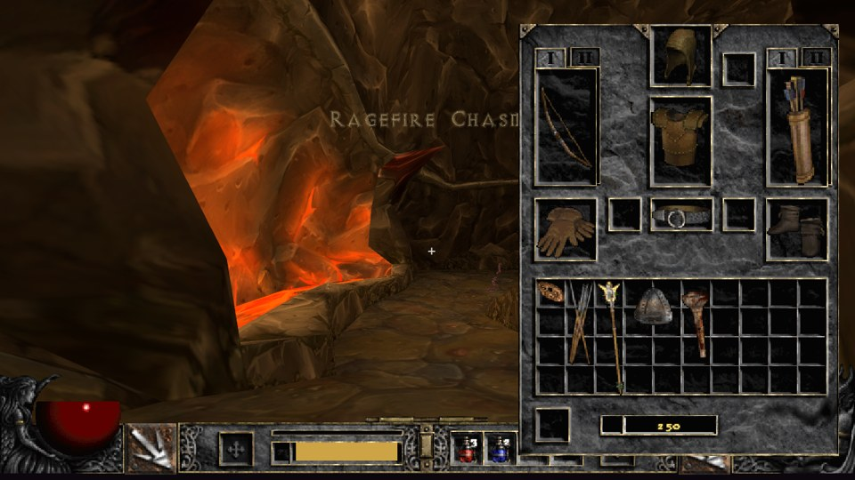
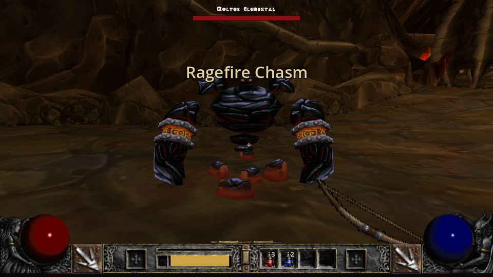
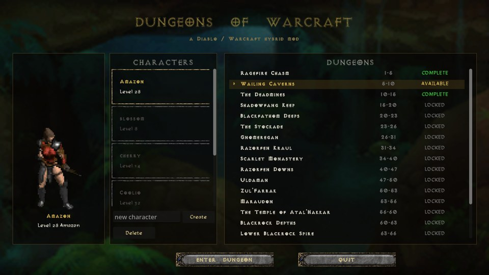

# Dungeons of Warcraft

*Diablo II × World of Warcraft — a loot-frenzy FPS*

*▶ [Watch the gameplay video](https://www.youtube.com/watch?v=rSDzyG9yryg)*

## What is it?

Dungeons of Warcraft is a mod that combines Diablo II and World of
Warcraft into a loot-frenzy FPS: vanilla WoW dungeons, walked in first
person as a Diablo II Amazon, with Diablo's interface, skills, stats and
drops. It is a non-commercial fan project and requires your own
installations of both **Diablo II: Lord of Destruction** and **World of
Warcraft**. Nothing from either game is included; every asset is generated
on your machine from your own installs.

## Who is it for?

Fans of Diablo II and World of Warcraft who want to engage with familiar
content in a different way than usual.

## Current limitations

- **Amazon only.** The other six classes are not playable.
- **All twenty dungeons** on the ladder are built, Ragefire Chasm to Upper
  Blackrock Spire, with Scarlet Monastery as four wings and Dire Maul as
  three, and the classic raids sit above them: Zul'Gurub, the Ruins of
  Ahn'Qiraj, Molten Core, Onyxia's Lair, Blackwing Lair and the Temple of
  Ahn'Qiraj. Some creatures have no model in the Anniversary client and a few
  event-summoned bosses have no spawn; those stand out in play.
- Windows only, keyboard and mouse only (no controller support).

## How do I install it?

Both games must be installed before you run setup; everything the mod
draws and plays is built from them.

### 1. Install Diablo II: Lord of Destruction

The original 2000–2001 game at patch 1.13 or 1.14, **not** Diablo II:
Resurrected (Resurrected does not ship the `.mpq` archives the build
reads). Blizzard still sells it:
**[Diablo II: Lord of Destruction — Battle.net Shop](https://us.shop.battle.net/en-us/product/diablo-ii-lord-of-destruction)**.
If you already own it, the installer is under
**[Diablo II (2000) downloads — Blizzard Support](https://us.support.blizzard.com/en/help/article/13867)**.
Original discs and the 1.14 installer both work. When it is right, the
game's folder contains `d2data.mpq` and `patch_d2.mpq`.

### 2. Install World of Warcraft Classic Anniversary

In the Battle.net app pick the **WoW Classic** tile and choose the
**Anniversary Edition** version (the current one is *Burning Crusade
Classic — Anniversary Edition*; the internal product name is
`wow_anniversary`). Retail, Classic Era, Season of Discovery and
Wrath/Cata Classic are different clients and will not work.

**Let it finish downloading.** The Anniversary client streams its data on
demand, and a partial install is missing files the build needs. Turn off
*play while downloading* and wait for the full install. When it is right,
the game's folder contains `Data\` and a `.build.info` file naming
`wow_anniversary`.

### 3. Download and set up the mod

1. **Download** the latest release zip from the
   [latest release](https://github.com/claytonkanderson/dungeons-of-warcraft/releases/latest) and unzip it anywhere.
2. **Run `setup.exe`.** It looks for both games on its own; if a field is
   empty or wrong, browse to `Diablo II.exe` and to `World of Warcraft
   Launcher.exe`. Click **Build assets** and wait for the bar to fill
   (5–10 minutes, about 600 MB, no internet needed). Windows SmartScreen
   may warn that the file is unsigned: choose *More info → Run anyway*.

### 4. Play

Run `DungeonsOfWarcraft.exe`, create a character, pick Ragefire Chasm, go.

<b>Screenshots</b>

| | |
|---|---|
|  |  |
|  |  |

## Controls

| | |
|---|---|
| WASD + mouse | move, look (arrow keys also turn and pitch) |
| Shift | run (stamina) |
| Space | jump |
| LMB / RMB (or K / L) | the two Diablo action slots |
| 1–4 | belt potions |
| F1–F5 | swap the right-hand skill |
| T | skill tree — click to spend, ctrl-click binds LMB, right-click binds RMB, hover and press F1–F5 to bind a hotkey |
| I / C | inventory, character sheet |
| E | interact, or pick up the item under the crosshair (its label is boxed; the nearest one if none is aimed at) |
| in water | look down to dive, up to rise; Space swims up, and hops out at the surface |
| Alt | show loot labels |
| F9 | manual save |

## Playing together

Up to four can clear a dungeon together, straight between your machines.
Everyone needs the game and the dungeon built on their own PC (it is
their own character, from their own save, that comes along; a clear
counts for everyone's ladder).

- **Host**: click HOST CO-OP on the menu. The lobby shows the address to
  send your friends; the game asks the router to open UDP 24601 by itself
  (UPnP). If it says the mapping was refused or no router answered,
  forward UDP 24601 to your PC in the router's settings. Windows will ask
  to allow the game through the firewall: allow it on private and public
  networks. Pick the dungeon and START SESSION takes everyone in.
- **Join**: click JOIN CO-OP, paste the host's address, Connect. On the
  host's own network use one of the LAN addresses the host's lobby lists.
  The host starts the dungeon; you load in beside them.

The host runs the creatures and the drops. Drops are free for all, as in
a Diablo II party, and every kill pays everyone. Monsters carry half
again their life for each extra player. Leaving the dungeon returns the
whole session to the lobby; the host quitting ends it.
| F11 | fullscreen |
| Esc | close panels, then the menu |

Characters are saved one file each in
`%APPDATA%\Godot\app_userdata\Dungeons of Warcraft\characters\`.

## For developers

Building from source, the asset pipeline, adding a dungeon, the test flags
and the project layout are in [DEVELOPMENT.md](DEVELOPMENT.md).

## License

[PolyForm Noncommercial 1.0.0](LICENSE): read it, run it, change it, fork
it, share it, for any noncommercial purpose. No Diablo II or World of
Warcraft content is in this repository or the download; the game reads
your own installs and writes the derived assets to your own machine.
Creature spawn and stat data comes from
[AzerothCore](https://github.com/azerothcore/azerothcore-wotlk) (AGPL-3.0),
vendored with attribution in `pipeline/ac_data/`. All third-party terms are
in [THIRD-PARTY.md](THIRD-PARTY.md). Diablo and Warcraft are trademarks of
Blizzard Entertainment; this is an unofficial fan project with no
affiliation or endorsement.
